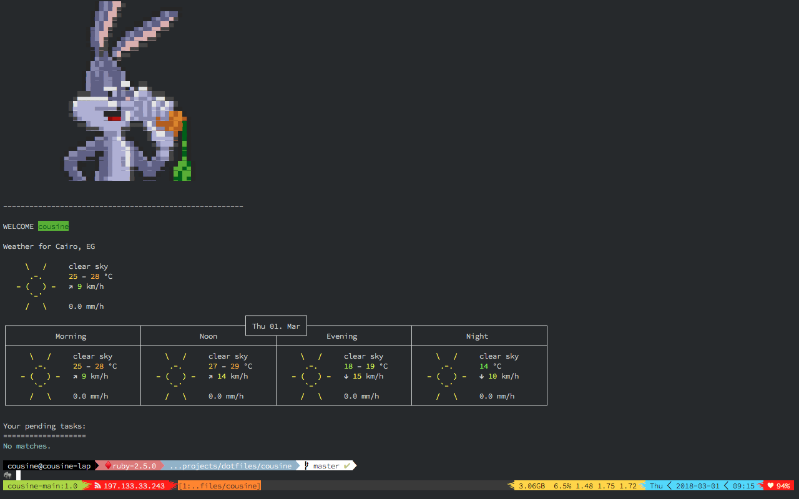
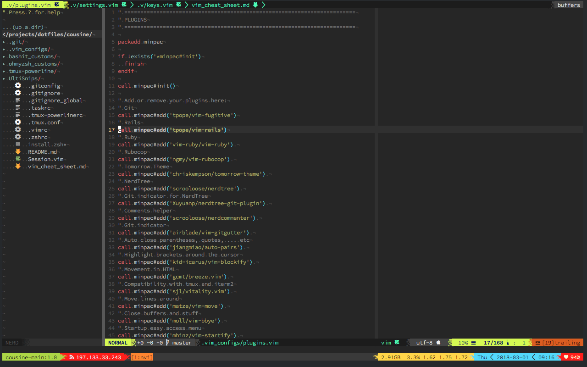

# Cousine's dotfiles

## Screenshots




## Configurations includes

* NeoVim (Vim should work too)
* BashIt custom scripts (Although I'm no longer using bash)
* Oh my zsh custom scripts
* Tmux
* [TaskWarrior](https://taskwarrior.org/)

## Installation

A zsh script for installation is available (for bash you'll have to do it manually).

```
$ install.zsh
```

NOTE: THIS MAY MESS UP YOUR SETUP, BE SURE YOU UNDERSTAND WHAT YOU ARE INSTALLING
BEFORE RUNNING THIS SCRIPT!

## VIM Cheat Sheet

A VIM cheat sheet is available [here]( ./vim_cheat_sheet.md )

## Message Of The Day (MOTD)

The motd script will automatically check for a `motd` text file in your home dir,
if found, it will `cat` this file and then check for a `.motd.zsh` script in `~`
and run it.

The motd run automatically only on the first pane in tmux, but you can call it
anytime using the `motd` alias.

In the screenshot above I'm using [wego](https://github.com/schachmat/wego) for
the weather report, and [TaskWarrior](https://taskwarrior.org/) for my pending
tasks.
